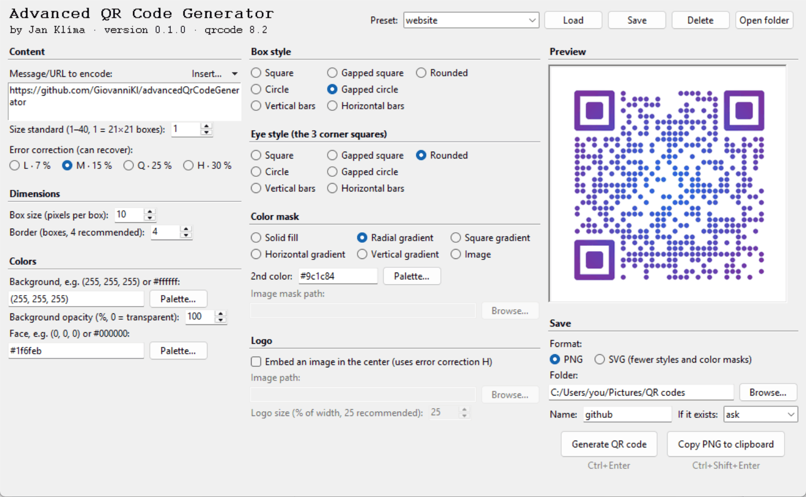

# Advanced QR Code Generator

A friendly desktop app for creating good-looking QR codes, styled the way
you want and checked in a live preview before you save them. Built with
Python, tkinter and the [`qrcode`][qrcode] library.



## Highlights

- **Live preview** that updates as you type, so you see every change
  before saving.
- **Your own style:** seven box styles, a separate style for the three
  corner "eyes", solid colors or gradients, a transparent background
  and a logo in the middle.
- **Ready-made content:** fill in a short form for a Wi-Fi network,
  contact card, e-mail, SMS, phone call, WhatsApp message, location,
  calendar event or bank payment (Czech QR Platba, EU SEPA), and phones
  know what to do with the code.
- **PNG or SVG**, or copy the code straight to the clipboard and paste
  it into a document or chat.
- **Presets** keep your favorite settings, and share them as small
  files.
- **Private by design:** everything runs on your own computer and works
  offline. No account, no tracking, nothing is uploaded; the only data
  the app stores are the presets you save yourself.
- Free and open source (MIT license), for Windows, macOS and Linux.

## Installation

You need Python **3.11 or newer** with `tkinter`. It is included in the
official installers from [python.org](https://www.python.org/downloads/)
for Windows and macOS; on Linux install e.g. the `python3-tk` package.
Everything else is installed automatically.

### For users
No git needed: pip downloads the app from GitHub and installs it
together with its dependencies.

Windows:

```bash
py -m pip install --user https://github.com/GiovanniKl/advancedQrCodeGenerator/archive/refs/tags/v0.1.0.zip
```

macOS / Linux:

```bash
python3 -m pip install --user https://github.com/GiovanniKl/advancedQrCodeGenerator/archive/refs/tags/v0.1.0.zip
```

This installs version 0.1.0. For a newer version, replace `v0.1.0` in
the link with its tag (see the [changelog](CHANGELOG.md)), or use
`refs/heads/main.zip` instead of `refs/tags/v0.1.0.zip` for the latest
development state.

> [!TIP]
> If you have [`pipx`](https://pipx.pypa.io), use
> `pipx install <the URL above>` instead. It keeps the app in its own
> isolated environment, so it can't clash with other Python packages.
> On recent Linux distributions (Debian, Ubuntu, Fedora, …) plain
> `pip install --user` is blocked with an "externally-managed-environment"
> error. Use pipx there.

### From a clone (for development)
```bash
git clone https://github.com/GiovanniKl/advancedQrCodeGenerator.git
cd advancedQrCodeGenerator
python -m venv .venv
```

Activate the virtual environment:

| OS | Command |
|---|---|
| Windows (PowerShell) | `.venv\Scripts\Activate.ps1` |
| Windows (cmd) | `.venv\Scripts\activate.bat` |
| macOS / Linux | `source .venv/bin/activate` |

Then install the app in editable mode together with the development
tools (needs pip 25.1 or newer, update with
`python -m pip install --upgrade pip`):

```bash
pip install -e . --group dev
pre-commit install
```

With `uv`, `uv sync` replaces the venv and pip steps (it creates `.venv`
itself and installs the dev tools too).

## Usage

Start the app with

```bash
py -m aqrgen
```

(`python3 -m aqrgen` on macOS / Linux, `python -m aqrgen` inside an
activated virtual environment). This always works. The shorter
`aqrgen` command works too if pip's scripts folder is on your PATH
(always the case with pipx or inside a virtual environment).

1. Type a message or URL, or use **Insert…** to fill one in from a form.
2. Pick styles and colors on the left and in the middle; the preview on
   the right shows the result.
3. Choose PNG or SVG, a folder and a name, and click **Generate QR
   code** (Ctrl+Enter). Or click **Copy PNG to clipboard**
   (Ctrl+Shift+Enter) to paste the code somewhere else.

## Features

**Content**
- **Insert…** (next to the message) fills in the message from a form
  for a standard format that phones understand:

  | Type | What a phone does with the code |
  |---|---|
  | Wi-Fi network | joins the network |
  | Contact (vCard) | offers to save the contact |
  | E-mail | opens a pre-filled e-mail |
  | SMS | opens a pre-filled text message |
  | Phone call | offers to call |
  | WhatsApp message | opens a chat with a pre-filled message |
  | Location | opens a maps app (Google Maps link or `geo:`) |
  | Calendar event | offers to add the event |
  | Payment (CZ QR Platba) | Czech banking apps pre-fill the payment |
  | Payment (EU SEPA, EPC) | many European banking apps pre-fill the payment |

  Inputs like IBANs, account numbers, dates and phone numbers are
  checked; a Czech account number (`19-2000145399/0800`) is converted
  to an IBAN automatically. The message stays editable afterwards.
- The message box grows with longer messages and scrolls once it fills
  the column.
- **Error correction** L, M, Q or H decides how much of the code can be
  damaged or covered while it still scans (hover over the options for
  details). The size standard grows automatically when the message
  doesn't fit.

**Look**
- **Box styles:** square, gapped square, rounded, circle, gapped
  circle, vertical and horizontal bars. The **eye style** sets the three
  corner squares separately (square eyes help scanners with fancy
  styles).
- **Colors:** background and face color, or a gradient (radial, square,
  horizontal, vertical) between the face color and a 2nd color, or an
  image as color mask. Colors can be written as `(255, 128, 0)` or
  `#ff8000`, or picked with **Palette…**.
- **Background opacity** from 100 % (opaque) down to 0 % (fully
  transparent), for PNG and SVG; the preview shows transparency as a
  checkerboard.
- **Logo:** tick "Embed an image" and pick an image; non-square logos
  keep their proportions. The logo size is set in % of the code width
  (25 % recommended; bigger logos can make the code unreadable).
  Embedding needs the highest error correction, so H is selected
  automatically.

**Output**
- **PNG** with every option, or **SVG** with the square, gapped square,
  circle and gapped circle styles, solid colors, radial/horizontal/
  vertical gradients and logos. Options SVG can't do are greyed out
  while SVG is selected; your previous choice comes back when you
  switch to PNG.
- **Copy PNG to clipboard** puts the code on the clipboard as an image
  (as PNG also when SVG is selected). On Linux this needs `wl-clipboard`
  or `xclip`.
- Generating runs in the background, so the window stays responsive.
  The window can be enlarged; the preview grows up to twice its normal
  size.

## Presets

A preset stores all settings under a name: type a name in the preset
box at the top and click **Save**; pick one from the dropdown and click
**Load**. **Open folder** shows where they are stored:

| OS | Presets folder |
|---|---|
| Windows | `%APPDATA%\aqrgen\presets` |
| macOS | `~/Library/Application Support/aqrgen/presets` |
| Linux | `~/.config/aqrgen/presets` (or `$XDG_CONFIG_HOME/aqrgen/presets`) |

Each preset is one JSON file, so you can share a preset by sending the
file and dropping it into a friend's presets folder.

Presets from versions before 0.1.0 (`.txt` files in a `presets` folder)
are imported automatically when you start the app from the old app's
folder. Otherwise click **Import…** and pick the old app's folder or its
`presets` folder. If a preset of the same name exists, the old one gets
a number (`wifi 2`). The old files are left untouched.

<details>
<summary>Preset file format</summary>

```json
{
  "format_version": 1,
  "settings": {
    "message": "https://example.com",
    "save_dir": "C:/Users/you/Pictures/QR codes",
    "file_name": "example",
    "on_collision": "ask",
    "version": 1,
    "error_correction": "M",
    "extension": ".png",
    "embed_image": false,
    "embedded_image_path": "",
    "logo_size": 25,
    "back_color": "(255, 255, 255)",
    "back_opacity": 100,
    "front_color": "(0, 0, 0)",
    "box_size": 10,
    "border": 4,
    "box_style": "square",
    "eye_style": "square",
    "color_mask": "solid",
    "mask_image_path": "",
    "edge_color": "(0, 0, 255)"
  }
}
```

| Setting | Values |
|---|---|
| `message`, `save_dir`, `file_name`, `embedded_image_path`, `mask_image_path` | text |
| `on_collision` | `"ask"`, `"overwrite"`, `"warn & abort"` |
| `version` | size standard, 1 to 40 |
| `error_correction` | `"L"`, `"M"`, `"Q"`, `"H"` |
| `extension` | `".png"`, `".svg"` |
| `embed_image` | `true`, `false` |
| `logo_size` | % of the code width, 5 to 50 |
| `back_color`, `front_color`, `edge_color` | `"(r, g, b)"` or `"#rrggbb"` |
| `back_opacity` | %, 0 (transparent) to 100 |
| `box_size` | pixels per box, 1 or more |
| `border` | boxes, 0 or more (4 recommended) |
| `box_style`, `eye_style` | `"square"`, `"gapsquare"`, `"rounded"`, `"circle"`, `"gapcircle"`, `"vbars"`, `"hbars"` |
| `color_mask` | `"solid"`, `"rgrad"`, `"sgrad"`, `"hgrad"`, `"vgrad"`, `"image"` |

Missing settings keep their current value; unknown ones are ignored.
</details>

## Development

- Code style: [Ruff](https://docs.astral.sh/ruff/) formatter and linter,
  80 characters per line, numpydoc docstrings with at most 72 characters
  per line. Configuration is in `pyproject.toml`.
- Tests: `pytest` (GUI tests are skipped automatically when Tk can't
  open a window).
- `pre-commit install` runs Ruff and numpydoc validation on every commit;
  `pre-commit run --all-files` runs them manually.
- GitHub Actions runs pre-commit and the tests on pushes to `main` and
  on pull requests: Python 3.11–3.14 on Ubuntu, 3.14 on Windows, and
  3.11 with the lowest allowed dependency versions. Start it manually
  for other branches from the Actions tab ("Run workflow").
- Package layout:
  - `aqrgen/core.py`: QR code generation and settings checks, no GUI
  - `aqrgen/svg.py`: styled SVG output
  - `aqrgen/payloads.py`: standard message formats (Wi-Fi, vCard, …)
  - `aqrgen/presets.py`: preset files
  - `aqrgen/clipboard.py`: copying images to the clipboard
  - `aqrgen/gui.py`, `aqrgen/insert_dialog.py`: tkinter GUI
- Dependencies: [`qrcode`][qrcode] 8.x (`>=8.2,<9`) and
  [`pillow`](https://pypi.org/project/pillow/) 10.0 or newer.
- Changes are listed in the [changelog](CHANGELOG.md); planned work is
  tracked in the [roadmap](ROADMAP.md).
- Releasing a version: set `version` in `pyproject.toml`, move the
  changelog's notes under the new version, merge to `main`, then tag
  it there: `git tag -a v0.2.0 -m "Version 0.2.0"` and
  `git push origin v0.2.0`.


[qrcode]:https://github.com/lincolnloop/python-qrcode
